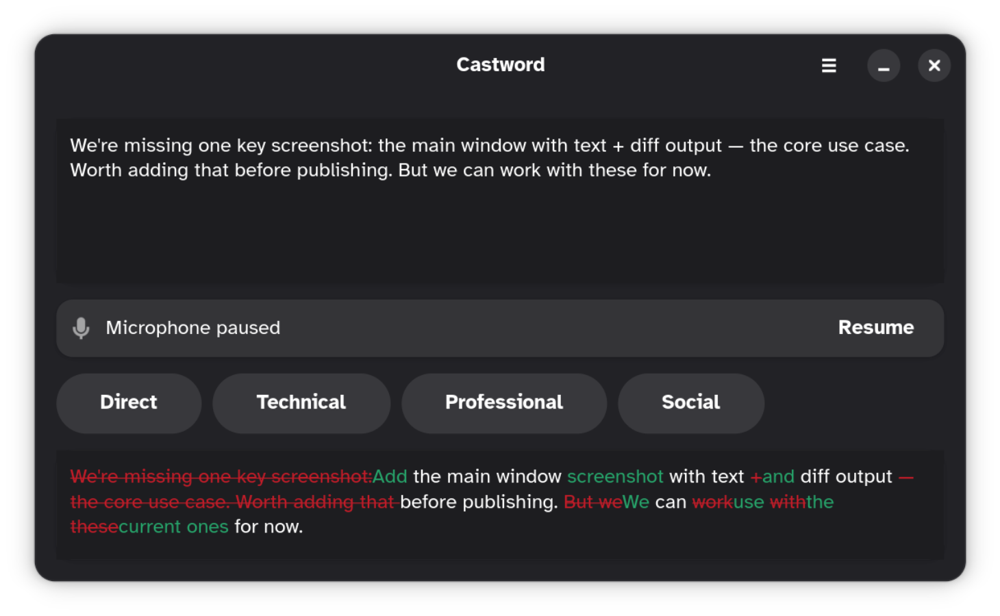
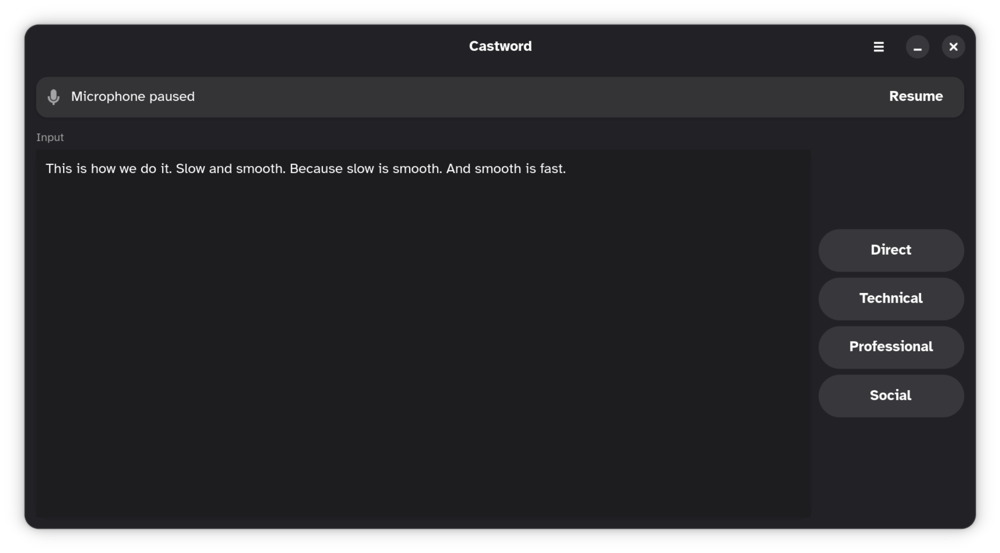
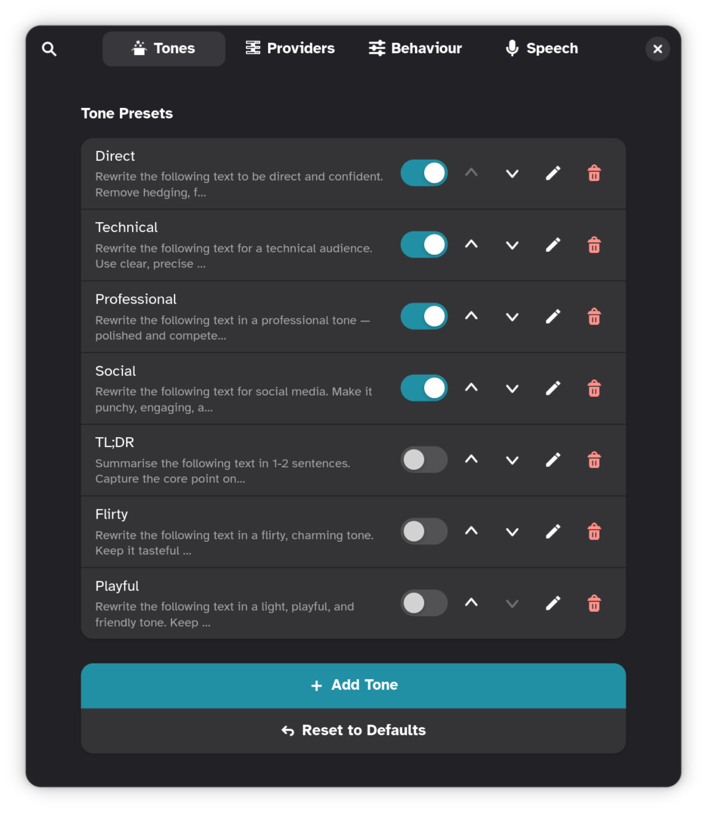
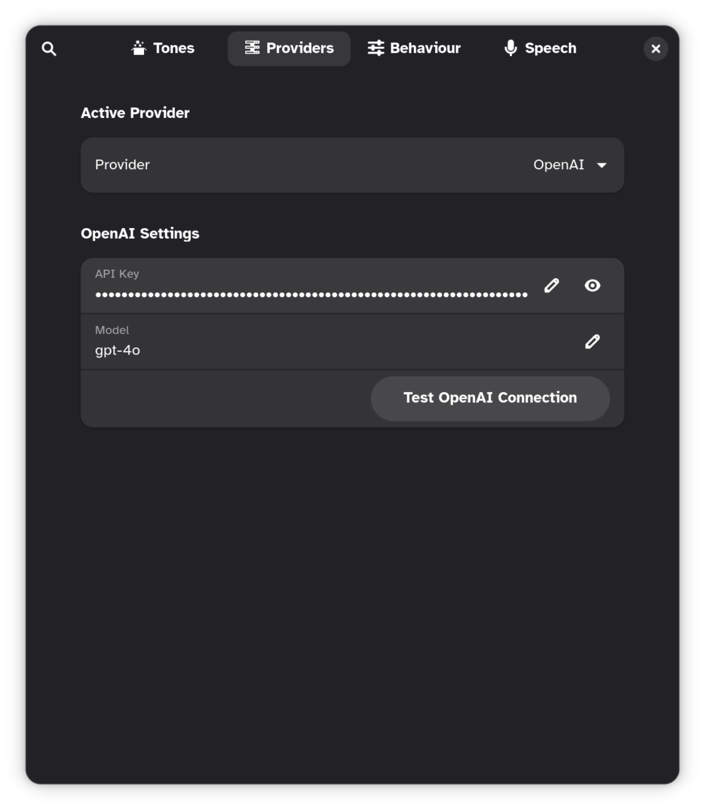
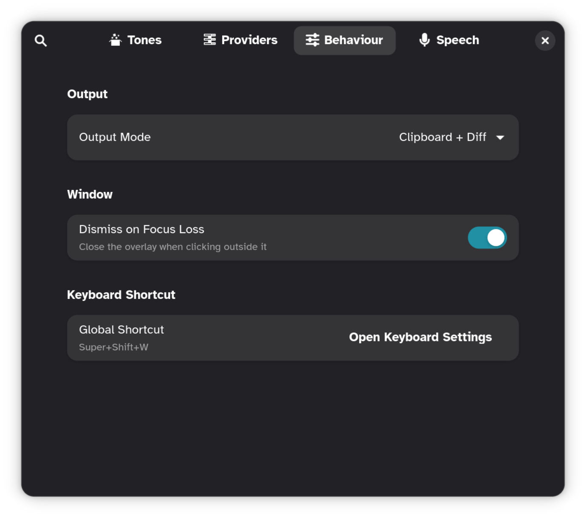
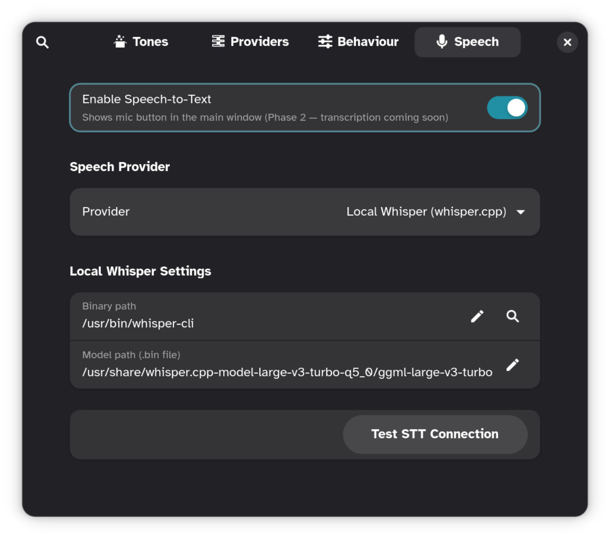

<p align="center">
  
</p>

# castword

GNOME overlay for AI-powered text rewriting. Press a shortcut from anywhere, paste or speak your text, pick a tone — result is on your clipboard.

Runs as a D-Bus service. GTK4 + Libadwaita. Supports OpenAI, Anthropic, Gemini, and Ollama.

---

## Install

### Arch (AUR)

```bash
yay -S castword-gnome-bin
```

### Other packages

| Format | Download |
|---|---|
| Debian `.deb` | [castword-gnome-2026-04-07-01.deb](https://github.com/Shape-Machine/castword-gnome/releases/download/v2026-04-07-01/castword-gnome-2026-04-07-01.deb) |
| AppImage | [Castword-2026-04-07-01-x86_64.AppImage](https://github.com/Shape-Machine/castword-gnome/releases/download/v2026-04-07-01/Castword-2026-04-07-01-x86_64.AppImage) |
| RPM | [castword-gnome-2026-04-07-01.rpm](https://github.com/Shape-Machine/castword-gnome/releases/download/v2026-04-07-01/castword-gnome-2026-04-07-01.rpm) |
| Flatpak | [xyz.shapemachine.castword-gnome-2026-04-07-01.flatpak](https://github.com/Shape-Machine/castword-gnome/releases/download/v2026-04-07-01/xyz.shapemachine.castword-gnome-2026-04-07-01.flatpak) |
| Source tarball | [castword-gnome-2026-04-07-01.tar.gz](https://github.com/Shape-Machine/castword-gnome/releases/tag/v2026-04-07-01) |

---

<p align="center">
  <a href="https://buy.stripe.com/9B68wQgat5kIgSBbXjes006"></a>
</p>

---

## Screenshots

<p align="center">
  
  
</p>

<p align="center">
  
  
  
  
</p>

### From source

**Prerequisites:** Python 3.11+, GTK4, Libadwaita, `uv`

```bash
# Arch
sudo pacman -S python-gobject

# Debian/Ubuntu
sudo apt install python3-gi python3-gi-cairo gir1.2-gtk-4.0 gir1.2-adw-1
```

```bash
git clone https://github.com/Shape-Machine/castword-gnome.git
cd castword-gnome
make install
```

`make install` creates a `.venv`, installs the package, and registers the D-Bus service, desktop file, icons, AppStream metadata, and GSettings schema.

---

## Setup

### Keyboard shortcut

castword is activated via a custom GNOME keyboard shortcut:

1. Open **GNOME Settings → Keyboard → Custom Shortcuts**
2. Add a new shortcut:
   - **Name:** `castword`
   - **Command:** `castword` (or the full path from `which castword`)
   - **Shortcut:** `Super+Shift+W` (or your preference)

The app will prompt you to set a shortcut on first launch if none is configured.

### Provider

API keys are auto-detected from your environment — no manual config needed if keys are already exported in your shell config.

| Provider | Environment variable |
|---|---|
| OpenAI | `OPENAI_API_KEY` |
| Anthropic | `ANTHROPIC_API_KEY` |
| Google Gemini | `GEMINI_API_KEY` or `GOOGLE_API_KEY` |
| Ollama | _(none — runs locally)_ |

To store keys separately, create `~/.config/castword/.env`:

```bash
echo 'OPENAI_API_KEY=sk-...' >> ~/.config/castword/.env
```

Switch provider and model in **Preferences → Providers**.

### Ollama

```bash
ollama serve
ollama pull llama3
```

Then select **Ollama** in Preferences.

---

## Tones

castword ships with seven built-in tones:

| Tone | Default | Purpose |
|---|---|---|
| Direct | ✅ | Remove hedging, say exactly what needs to be said |
| Technical | ✅ | Structured with headings/bullets, precise language |
| Professional | ✅ | Polished and human — emails, LinkedIn, client comms |
| Social | ✅ | Punchy, engaging, emoji-ok — posts and marketing |
| TL;DR | — | 1–2 sentence summary |
| Flirty | — | Fun |
| Playful | — | Fun |

Add, edit, reorder, or toggle tones in **Preferences → Tones**. Each tone has a name and a fully editable system prompt.

---

## Development

```bash
git clone https://github.com/Shape-Machine/castword-gnome.git
cd castword-gnome
make run
```

| Command | Description |
|---|---|
| `make run` | Compile schema locally and launch |
| `make install` | Full system install |
| `make clean` | Remove `__pycache__`, `.pyc`, compiled schema, `.venv` |
| `make release VERSION=yyyy-mm-dd-NN` | Build and publish all package formats |

Bug reports and feature requests: [github.com/Shape-Machine/castword-gnome/issues](https://github.com/Shape-Machine/castword-gnome/issues)
